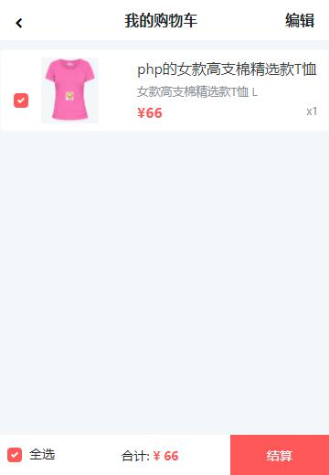

# TShe

> A POOR imitation of https://www.tshe.com/ (mobile only)

## Screenshots





## Install

1. Run in your terminal:

``` bash
$ git clone https://github.com/hldh214/TShe.git
```

2. Set your environment variables in your .env file (use the .env.example as an example);

3. Run in your tshe folder:

``` bash
$ composer install
$ php artisan key:generate
$ php artisan migrate
$ php artisan db:seed
```

4. http://laravel-admin.org/docs/#/zh/installation

## Usage 

1. Register a new user at http://tshe.dev/register
2. Your admin panel will be available at http://tshe.dev/admin

Note: Depending on your configuration you may need to define a site within NGINX or Apache; Your URL domain may change from localhost to what you have defined.

## Contribution

Feel free to contribute.

* Found a bug? Try to find it in issue tracker https://github.com/hldh214/TShe/issues ... If this bug is missing - you can add an issue about it.
* Can/want/like develop? Create pull request and I will check it in nearest time! 


## License

TShe is open-sourced software licensed under the [MIT license](http://opensource.org/licenses/MIT).